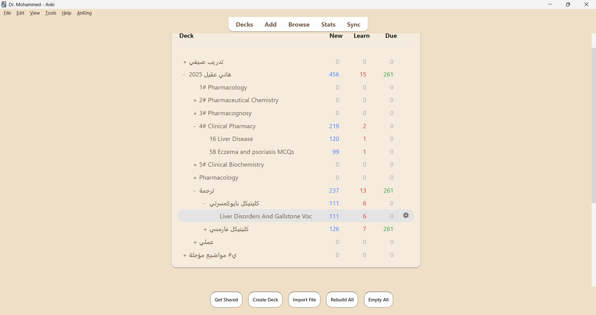
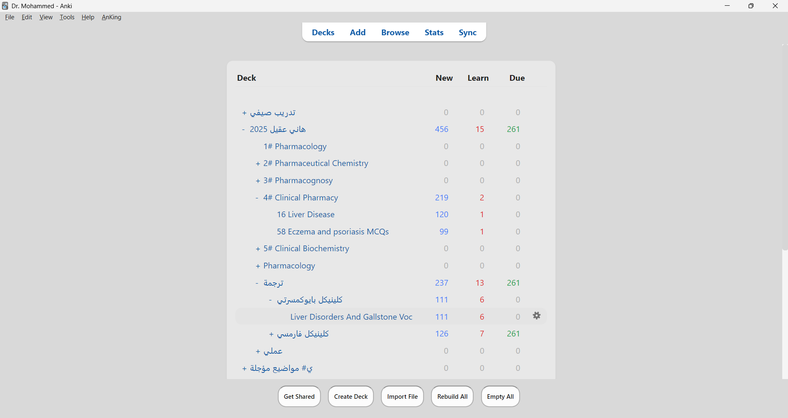
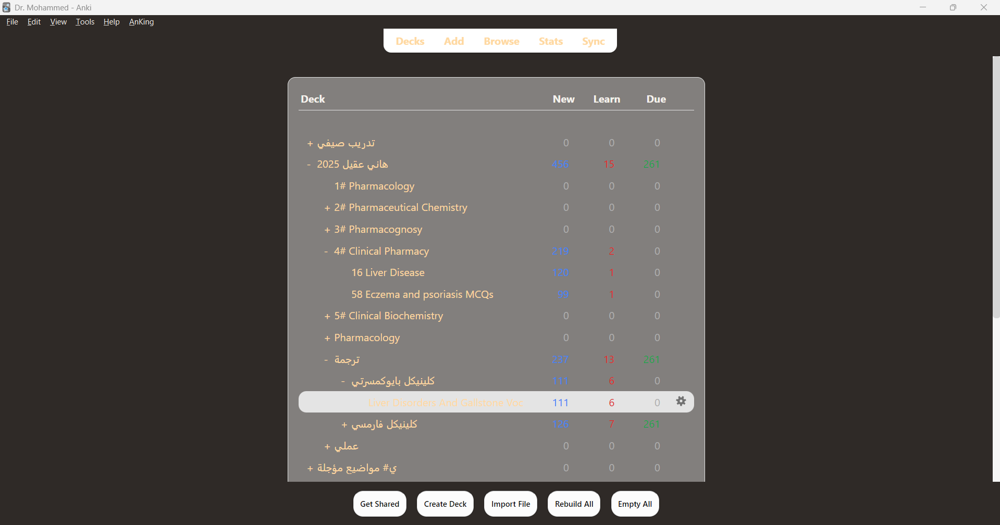

# AnkiThemeTwin

✨ **AnkiThemeTwin** brings **eye-comfort themes** to Anki — inspired by **Microsoft Word Immersive Reader (Sepia / Gray)** and custom **Soft Dark** themes, all tuned for **font visibility** and **anti-glare**.

---

## 🎨 Features
- **7 High-Readability Themes**:
  - Sepia (Word-like)
  - Sepia (Paper)
  - Sepia (Special • Dr. Mohammed)
  - Gray (Word-like)
  - Gray (Paper)
  - Dark • Warm (Soft)
  - Dark • Neutral (Soft)
- Designed for **eye comfort** in bright or dim rooms.
- **Fonts with high contrast** (passes WCAG AA guidelines).
- Easy theme switching via **Tools → Theme: AnkiThemeTwin**.
- **About dialog** with project details and GitHub link.
- Compatible with **Anki 2.1.55+ (Qt6 / PyQt6)** — tested on Anki 25.x.

---

## 📸 Screenshots
| Sepia Special | Gray Paper | Dark Warm Soft |
|---------------|------------|----------------|
|  |  |  |

*(Screenshots live in `/images` in this repo.)*

---

## 📥 Installation

### Option A — from AnkiWeb (recommended)
- **AnkiWeb page:** https://ankiweb.net/shared/info/1256951397  
- **Add-on ID:** `1256951397`  
  Open Anki → **Tools → Add-ons → Get Add-ons…** → paste the ID → Install.

### Option B — manual file
1. Download the latest `.ankiaddon` from **[Releases](../../releases)**.  
2. In Anki: **Tools → Add-ons → Install from File…** and choose the file.  
3. Restart Anki.

---

## ⚙️ Requirements
- **Anki 2.1.55+** (Qt6/PyQt6). Older Qt5 builds are not supported.

---

## 🧰 Troubleshooting
- Colors didn’t change? Restart Anki, and ensure no other theming add-on overrides styles.
- You can switch any time from **Tools → Theme: AnkiThemeTwin**.
- Problems or feature requests? Open an issue on GitHub (link below).

---

## 🔗 Links
- **AnkiWeb:** https://ankiweb.net/shared/info/1256951397  
- **GitHub Repository:** https://github.com/MohammedTsmu/AnkiThemeTwin  
- **Issues (support):** https://github.com/MohammedTsmu/AnkiThemeTwin/issues

---

## 📝 Author
Developed with 💻 + ☕ by **Dr. Mohammed**.  
Feedback, issues, and contributions are welcome on GitHub.

---

## 📚 References
- Anki add-on hooks (CSS injection via `webview_will_set_content`)  
  https://addon-docs.ankiweb.net/hooks-and-filters.html
- Packaging & sharing add-ons (`.ankiaddon` zip format)  
  https://addon-docs.ankiweb.net/sharing.html
- Installing add-ons from Anki (Get Add-ons / Install from file)  
  https://docs.ankiweb.net/addons.html
- Qt Style Sheets (QSS) for widget theming  
  https://doc.qt.io/qt-6/stylesheet.html
- WCAG 2.1 contrast guidance (readability)  
  https://www.w3.org/WAI/WCAG21/Understanding/contrast-minimum.html
- Word Immersive Reader (background/page color)  
  https://support.microsoft.com/en-us/office/use-immersive-reader-in-word-a857949f-c91e-4c97-977c-a4efcaf9b3c1
